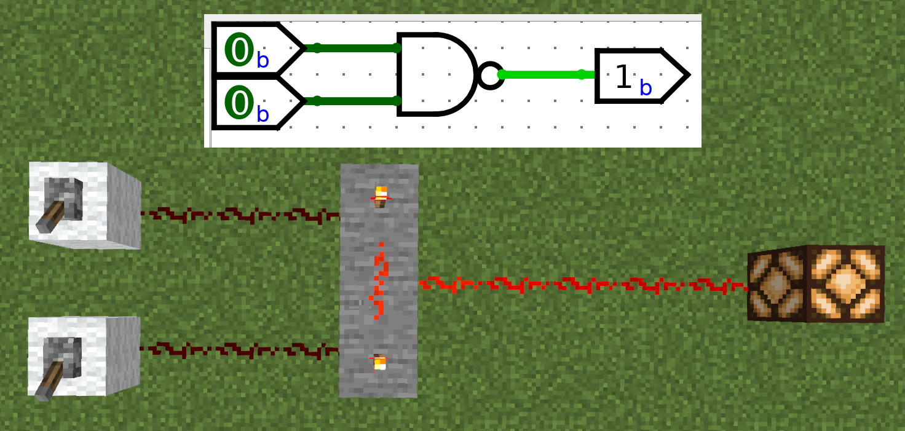

# logisim2mc
POC - Convert Logisim's diagram to Minecraft's redstone logic

This is a weekend project - proof of concept of converting logisim diagrams into working Minecraft redstone circuits.  
Logisim Evolution was used for generating XML files.  
There are only wires, NAND gates and in/out pins implemented, but new components are easy to be added by implementing abstract classes.

